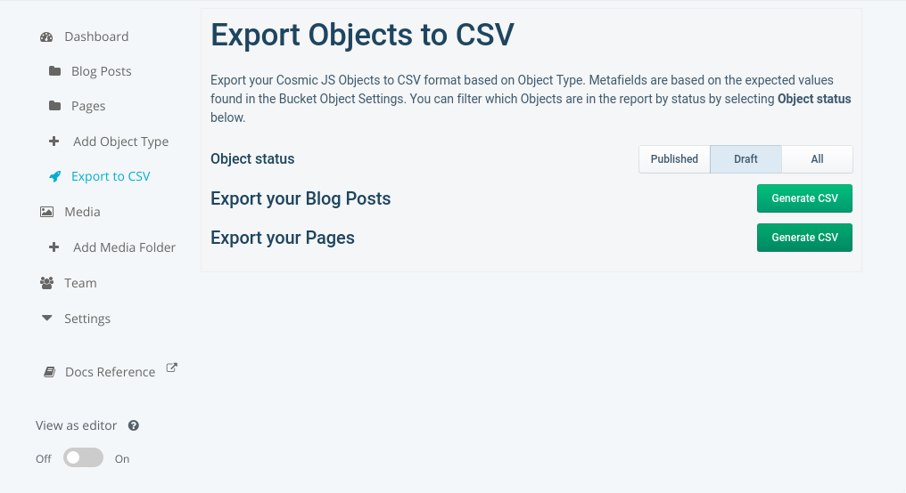

# Cosmic JS To CSV Extension

The CosmicJS to CSV extension is a JAM-stack application that allows you to export your Buckets in a CSV format.
The plugin also will automatically parse metadata fields as specified by the Object Type settings.

## Installing

### Cosmic App Store
[Install Extension](https://cosmicjs.com/extensions/export-to-csv)

### Manually build

After cloning this repository, dependencies can be installed with `npm install` or `yarn install`.
After the required dependencies are installed, the extension can be built with `npm run build`.

This will create a `build.zip` file in the root project directory, which can be dragged into the Cosmic
JS extensions area to be automatically installed.

This project was bootstrapped with [Create React App](https://github.com/facebook/create-react-app).
